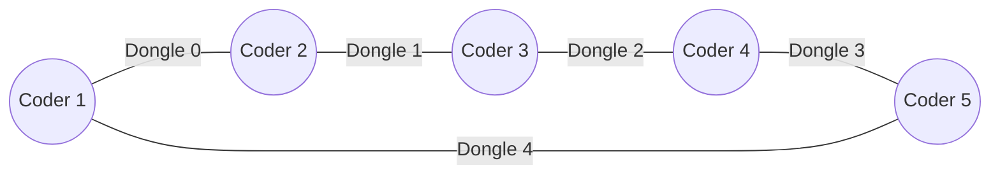
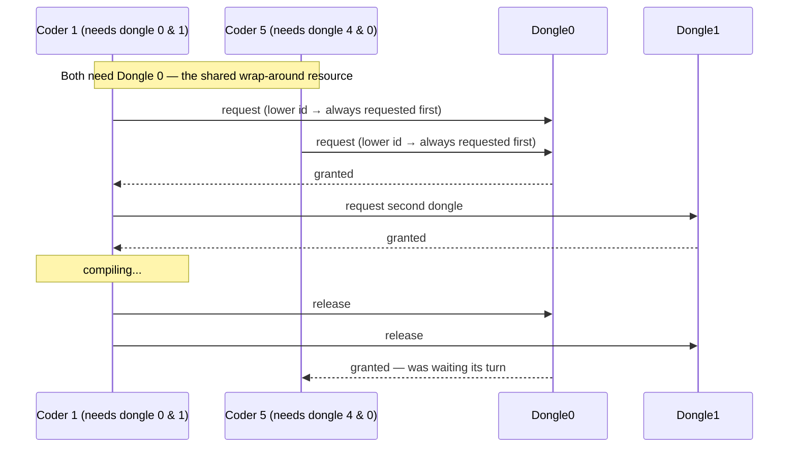
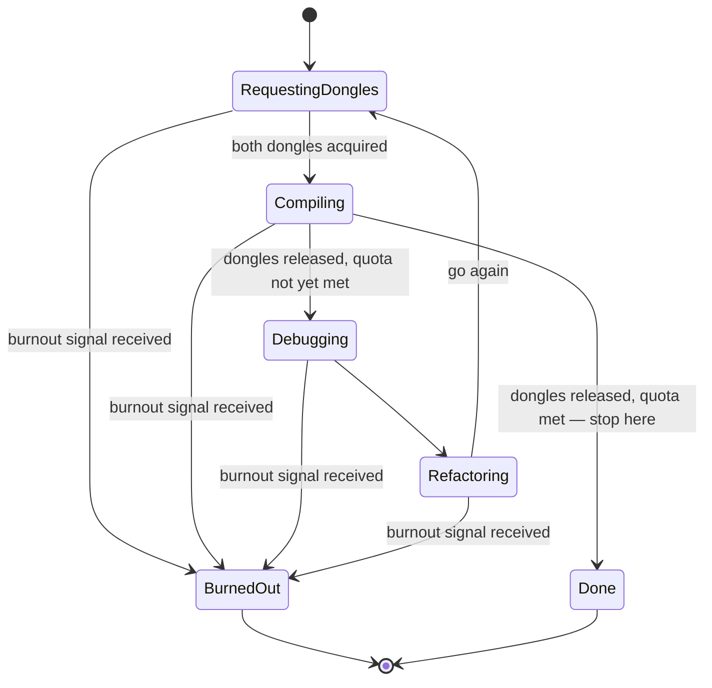
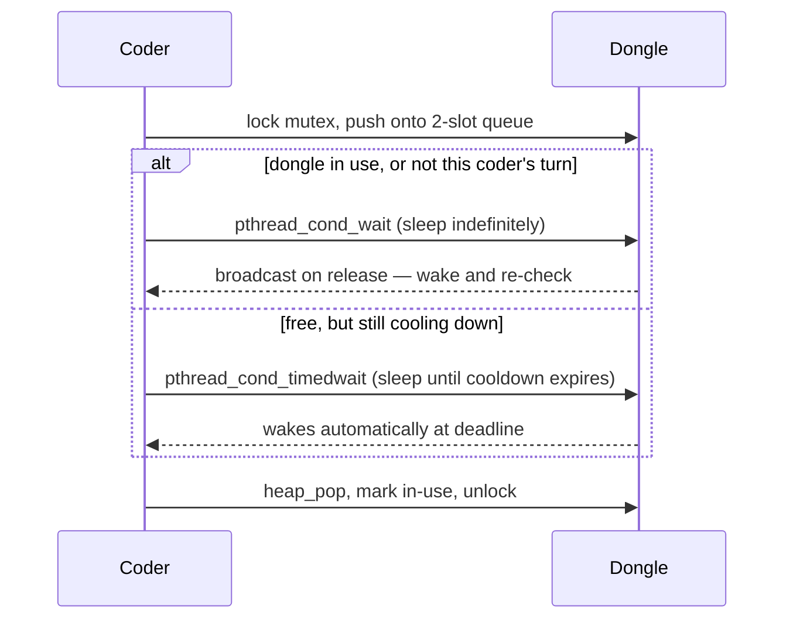
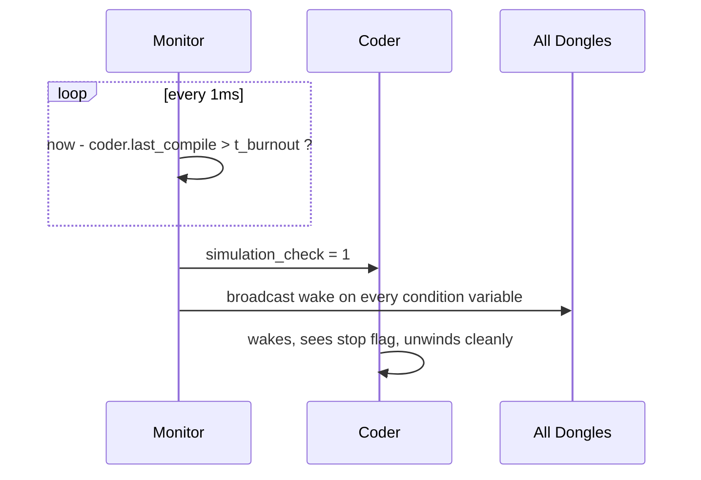

<div align="center">

# ThreadSmith — The Deadlock-Free Concurrency Engine
**A High-Performance POSIX Threads & Scheduling Simulation**


[]()
[]()
[]()

*A strictly-timed POSIX threading simulation that turns the classic Dining
Philosophers problem into a real-time scheduling race — built to survive
`-fsanitize=thread`, not just compile.*

</div>

---

## 🧠 The Premise

Picture a circular co-working space. `N` coders sit around a shared table,
and between every adjacent pair sits exactly one USB dongle — so there are
also `N` dongles. To compile, a coder needs **both** dongles on either side
of them, at the same time.

Once compiled, they debug, then refactor, then go again. If a coder can't
*start* a new compile within its burnout window, it burns out — and the
whole simulation stops.

Five coders, five dongles, all wanting two neighbors' resources at once, in
a ring — that's the Dining Philosophers problem wearing a different costume.
ThreadSmith is a from-scratch C implementation of the synchronization needed
to run that safely: no busy-waiting, no torn output, no deadlock, and a
provably correct reason for every locking decision.

---

## 🚀 Key Features

- **Zero busy-waiting.** Every wait is a real OS-level sleep —
  `pthread_cond_wait` for indefinite waits, `pthread_cond_timedwait` for
  cooldown expiry — never a polling loop burning CPU.
- **Two interchangeable schedulers, one code path.** FIFO and EDF
  (Earliest Deadline First) share the exact same heap and wait logic —
  switching between them is a single line inside one function. See
  [Under the Hood](#-under-the-hood-one-heap-two-schedulers) for why.
- **Deadlock is structurally impossible, not just avoided by luck.** A
  strict resource-ordering rule (always acquire the lower-id dongle first,
  globally) makes circular wait — the one Coffman condition that actually
  causes deadlock in this problem — mathematically unreachable.
- **A watchdog thread with millisecond precision.** A dedicated monitor
  thread polls every 1ms and detects burnout independently of whatever phase
  a coder happens to be in.
- **Fully serialized, race-free logging.** Every log line goes through one
  lock; verified with `ThreadSanitizer` across dozens of stress runs,
  including deliberately forced burnout scenarios.

---

## 📐 Architecture & Diagrams

### 1. The ring topology

Coders and dongles alternate around a circle. Coder `N` and coder `1` share
a dongle too — the ring wraps around, it doesn't just stop at the ends.



Because a dongle physically sits between exactly two coders, and each coder
only ever has one outstanding request at a time, **no dongle can ever have
more than two simultaneous contenders.** That single fact is what justifies
a fixed 2-slot priority queue per dongle instead of a general-purpose heap —
not a shortcut, a proof.

### 2. Why this can't deadlock

The classic failure mode: everyone grabs their left-hand resource at once,
then waits forever for their right-hand one, which their neighbor is also
holding. ThreadSmith breaks this by making every coder request the
**numerically lower dongle id first**, always — regardless of which hand it
physically is.



Every coder in the whole ring agrees on this same global ordering, so a
closed cycle of "holding one, waiting on another" can never form — the one
precondition deadlock actually needs.

### 3. A coder's state machine



A coder that just hit its required compile count stops immediately after
releasing its dongles — it doesn't run one more debug/refactor cycle it no
longer needs.

### 4. Waiting for a dongle — condition variables, not polling



The thread is never spinning — it's genuinely asleep, and the OS wakes it
exactly when there's something to actually check again.

### 5. Burnout detection, running in parallel



The monitor doesn't care what phase a coder is in — compiling, debugging, or
stuck waiting for a dongle — it watches the clock independently, which is
what lets burnout be detected and logged within milliseconds of the actual
deadline, every time.

---

## 🛠️ Usage & Installation

```bash
git clone git@github.com:<your-username>/ThreadSmith.git
cd ThreadSmith
make
```

```
./threadsmith <coders> <burnout_ms> <compile_ms> <debug_ms> <refactor_ms> <required_compiles> <cooldown_ms> <scheduler>
```

### Project structure

```
ThreadSmith/
├── src/                  # all implementation files
├── include/
│   └── threadsmith.h     # single shared header
├── Makefile              # out-of-source build, objects land in obj/
├── .github/workflows/    # CI: build + sanitizers + smoke tests on every push
├── LICENSE
└── README.md
```

`make` builds every object into `obj/` (kept out of `src/`) and links the
final binary at the repo root. `make clean` removes `obj/`, `make fclean`
also removes the binary, `make re` does both and rebuilds from scratch.

| Argument | Meaning |
|---|---|
| `coders` | Number of coder threads spawned (also the number of dongles) |
| `burnout_ms` | Max time since starting the last compile before a coder burns out |
| `compile_ms` / `debug_ms` / `refactor_ms` | Time spent in each phase |
| `required_compiles` | Simulation ends once every coder reaches this count |
| `cooldown_ms` | Time a released dongle must rest before being taken again |
| `scheduler` | `fifo` or `edf` |

**Example — comfortable run, no burnout expected:**
```bash
./threadsmith 5 3000 200 200 200 10 400 fifo
```

**Example — deliberately infeasible, should burn out fast:**
```bash
./threadsmith 1 800 200 200 200 10 0 fifo
```
(One coder, one dongle, needs two to compile — it can never succeed, and
burns out right on schedule around `t = 800`.)

---

## 🔬 Under the hood: one heap, two schedulers

Every dongle owns a fixed **2-slot priority structure** — not a
general-purpose heap padded with unused capacity, but sized to exactly the
maximum contention the ring topology can ever produce (see diagram 1).
Both scheduling policies flow through the *identical* push/pop/wait logic;
the only thing that differs between them is the one number handed to the
queue as priority, chosen inside a single function:

```c
long	get_priority(t_coder *coder)
{
	if (coder->data->args.scheduler == 1)          // edf
		return (coder->last_compile + coder->data->args.t_burnout);
	return (time_get());                            // fifo
}
```

- **FIFO** — priority is the timestamp of the request itself. Smallest
  number (earliest arrival) wins.
- **EDF** — priority *is* the coder's actual burnout deadline. Smallest
  number (soonest to die) wins, regardless of who asked first.

Since the queue always serves the smallest priority first, changing what
"urgency" means is a one-line change, not a rewrite. (It's also, for the
curious, exactly how a third scheduling policy — LIFO — was added later as
an exercise: negate the FIFO timestamp, and "smallest" flips to mean "most
recent" instead.)

---

## 🧪 Engineering rigor — what was actually verified, not just claimed

Every one of these was run and checked, not assumed:

- **Compilation:** `-Wall -Wextra -Werror -pthread`, zero warnings.
- **No global mutable state**, anywhere — scanned across every source file.
- **ThreadSanitizer:** dozens of runs, including runs deliberately engineered
  to hit the burnout path and heavy multi-coder contention — clean.
- **AddressSanitizer + LeakSanitizer:** clean across full runs.
- **Dongle safety:** a diagnostic build logging the *actual* physical dongle
  id (not just coder id) on every acquire/release, checked programmatically
  across hundreds of acquisitions — zero duplicate holds, zero cooldown
  violations.
- **Log ordering:** scripted verification that every "is compiling" line is
  immediately preceded by exactly its own two dongle-acquisition lines, even
  under heavy 8-coder contention — 80/80 correct.
- **Burnout precision:** detected and logged within 1–2ms of the actual
  deadline across every test run, comfortably inside a 10ms tolerance.

### Honest limitation found during stress testing

Under one specific combination — heavy dongle cooldown relative to a tight
burnout window — **EDF was observed failing to prevent starvation in a case
where FIFO succeeded on identical parameters.** Each dongle's scheduler only
has local knowledge of its own (at most two) contenders, with no
cross-dongle awareness — which is the most likely mechanism behind a coder
being starved even under a policy that's supposed to protect it. This wasn't
swept under the rug: it was found through deliberate repeated stress testing
on real hardware, not a single lucky (or unlucky) run, and is left here
documented rather than hidden, because a synchronization project is more
convincing when its edge cases are known than when everything is claimed to
be flawless.

---

## 📜 Acknowledgments

- Built as part of the 42 Network curriculum.
- Concurrency design shaped by *Operating Systems: Three Easy Pieces*
  (OSTEP), particularly its treatment of condition variables and the dining
  philosophers problem.
